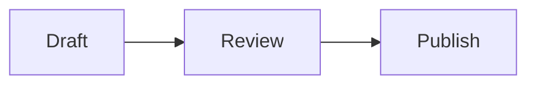

# Markdown syntax reference

## Emphasis

Try **bold**, *italics*, ~~strikethrough~~, and `inline code`.

## Lists

- First item
- Second item

1. Open the document
2. Read the preview

- [x] Draft created
- [ ] Draft reviewed

## Table alignment

| Item | Quantity | Status |
| :--- | ---: | :---: |
| Notebook | 2 | Ready |
| Pen | 4 | Ready |

## Code

```javascript
const title = 'Release notes';
console.log(title);
```

## Quote and footnote

> Keep the explanation close to the example.

A detail with extra context.[^note]

[^note]: This footnote appears at the end of the document.

## Math

Inline math: $E = mc^2$

## Diagram


